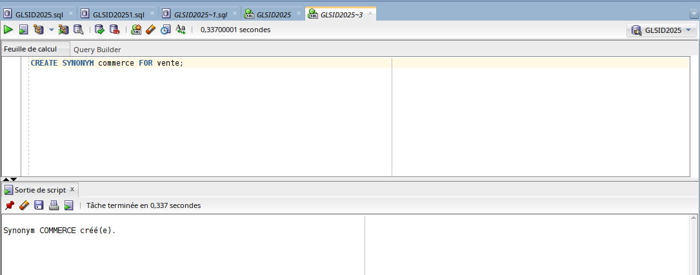
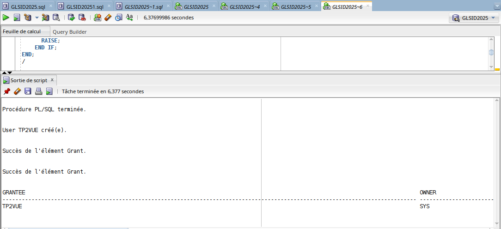

#### Partie 3 : SQL (Objets avancés)

### 1. Création de tables
## Table vente en cluster:

```sql
CREATE TABLE vente (
  id_prod NUMBER(6) NOT NULL,
  id_client NUMBER NOT NULL,
  id_temps DATE NOT NULL,
  id_canal CHAR(1) NOT NULL,
  id_promo NUMBER(6) NOT NULL,
  sold_quantite NUMBER(3) NOT NULL,
  sold_montant NUMBER(10,2) NOT NULL
)
CLUSTERING BY LINEAR ORDER (id_prod, id_client);
```


## Table vente2 partitionnée:

```sql
CREATE TABLE vente2 (
  id_prod NUMBER(6),
  id_client NUMBER,
  id_temps DATE,
  id_canal CHAR(1),
  id_promo NUMBER(6),
  sold_quantite NUMBER(3),
  sold_montant NUMBER(10,2)
)
PARTITION BY RANGE (id_temps) (
  PARTITION sales_q1_2006 VALUES LESS THAN (TO_DATE('01-APR-2006','dd-MON-yyyy')),
  PARTITION sales_q2_2006 VALUES LESS THAN (TO_DATE('01-JUL-2006','dd-MON-yyyy')),
  PARTITION sales_q3_2006 VALUES LESS THAN (TO_DATE('01-OCT-2006','dd-MON-yyyy')),
  PARTITION sales_q4_2006 VALUES LESS THAN (TO_DATE('01-JAN-2007','dd-MON-yyyy'))
);
```


### 2. Gestion des séquences

## Création:

```sql
CREATE SEQUENCE id_prod
START WITH 1000
INCREMENT BY 1
NOCACHE
NOCYCLE;
```


## Suppression:

```sql
DROP SEQUENCE id_prod;
```


### 3. Dimensions et synonymes

## Création de dimension:

```sql
CREATE DIMENSION produits_dim
LEVEL canal IS (vente.id_canal)
LEVEL souscategorie IS (vente.id_client)
LEVEL categorie IS (vente.id_prod)
HIERARCHY prod_rollup (
  canal CHILD OF
  souscategorie CHILD OF
  categorie
)
ATTRIBUTE canal DETERMINES (vente.id_temps)
ATTRIBUTE souscategorie DETERMINES (vente.sold_montant)
ATTRIBUTE categorie DETERMINES (vente.id_promo);
```


## Création de synonyme:


```sql
CREATE SYNONYM commerce FOR vente;
```


#### Partie 4 : SQL Developer

### 1. Création des tables

## Table APPT:

```sql
CREATE TABLE APPT (
  NAppt INT NOT NULL,
  Ligneadresse1 VARCHAR(50),
  Ligneadresse2 VARCHAR(50),
  Ligneadresse3 VARCHAR(50),
  CodePostal INT,
  Ville VARCHAR(20),
  Pays VARCHAR(20),
  Batiment VARCHAR(20),
  Escalier VARCHAR(20),
  Etage INT,
  Porte INT,
  CONSTRAINT APPT_pk PRIMARY KEY (NAppt)
);
```


## Table ETREHUMAIN:
```sql
CREATE TABLE ETREHUMAIN (
  NUMSEC INT NOT NULL,
  NAppt INT,
  NOM VARCHAR(20),
  PRENOM VARCHAR(20),
  DATENAISSANCE DATE,
  SEXE VARCHAR(20),
  CONSTRAINT ETREHUMAIN_pk PRIMARY KEY (NUMSEC),
  CONSTRAINT ETREHUMAIN_APPT_fk FOREIGN KEY (NAppt) REFERENCES APPT(NAppt)
);
```


### 2. Gestion des utilisateurs
## Création utilisateur TP2:

```sql
ALTER SESSION SET "_ORACLE_SCRIPT"=TRUE;
CREATE USER TP2 IDENTIFIED BY TP2;
GRANT ALL ON APPT TO TP2;
GRANT ALL ON ETREHUMAIN TO TP2;
GRANT CONNECT TO TP2;
```


### 3. Insertion de données
## Exemple pour APPT:

```sql
INSERT INTO APPT (
  NAppt, 
  Ligneadresse1, 
  Ligneadresse2, 
  Ligneadresse3, 
  CodePostal, 
  Ville, 
  Pays, 
  Batiment, 
  Escalier, 
  Etage, 
  Porte
) 
VALUES (
  1, 
  'Appt1', 
  'Rue11', 
  '', 
  20000,  -- Example postal code (you need to provide actual value)
  'Casablanca', 
  'Maroc', 
  'A', 
  '2', 
  1, 
  101    -- Example door number (you need to provide actual value)
);
```


## Exemple pour ETREHUMAIN:
```sql
-- Version plus robuste avec liste explicite des colonnes
INSERT INTO ETREHUMAIN (NUMSEC, NAPPT, NOM, PRENOM, DATENAISSANCE, SEXE)
VALUES (1, 1, 'Amor', 'Yassin', TO_DATE('20/01/1980','DD/MM/YYYY'), 'M');

-- Insertion des autres enregistrements
INSERT INTO ETREHUMAIN (NUMSEC, NAPPT, NOM, PRENOM, DATENAISSANCE, SEXE)
VALUES (2, 1, 'Amor', 'Amina', TO_DATE('14/02/1976','DD/MM/YYYY'), 'F');

```


### 4. Exécution des requêtes
## Requête simple:

```sql
SELECT a.NAppt 
FROM APPT a 
WHERE a.NAppt BETWEEN 1 AND 3
ORDER BY a.NAppt;
```


## Requête complexe:

```sql
SELECT a.NAppt, a.Ville, a.Pays, e.NOM, e.PRENOM
FROM APPT a
JOIN ETREHUMAIN e ON a.NAppt = e.NAppt 
WHERE e.NOM LIKE 'M%' OR e.NOM LIKE 'A%'
ORDER BY a.NAppt, e.NOM;
```

### 5. Gestion des transactions

```sql
DECLARE
  v_count NUMBER;
BEGIN
  -- Vérifier si l'enregistrement existe
  SELECT COUNT(*) INTO v_count FROM APPT WHERE NAppt = 1;
  
  IF v_count > 0 THEN
    -- Début de la transaction
    SAVEPOINT before_update;
    
    -- Mise à jour
    UPDATE APPT SET Pays = 'MOROCCO' WHERE NAppt = 1;
    
    -- Vérification
    DBMS_OUTPUT.PUT_LINE('Après mise à jour :');
    FOR rec IN (SELECT * FROM APPT WHERE NAppt = 1) LOOP
      DBMS_OUTPUT.PUT_LINE('NAppt: ' || rec.NAppt || ', Pays: ' || rec.Pays);
    END LOOP;
    
    -- Annulation
    ROLLBACK TO SAVEPOINT before_update;
    
    -- Vérification après annulation
    DBMS_OUTPUT.PUT_LINE('Après rollback :');
    FOR rec IN (SELECT * FROM APPT WHERE NAppt = 1) LOOP
      DBMS_OUTPUT.PUT_LINE('NAppt: ' || rec.NAppt || ', Pays: ' || rec.Pays);
    END LOOP;
    
    -- Validation
    COMMIT;
    DBMS_OUTPUT.PUT_LINE('Transaction terminée avec succès.');
  ELSE
    DBMS_OUTPUT.PUT_LINE('Aucun enregistrement avec NAppt = 1 trouvé.');
  END IF;
EXCEPTION
  WHEN OTHERS THEN
    ROLLBACK;
    DBMS_OUTPUT.PUT_LINE('Erreur: ' || SQLERRM);
END;
/
```


### 6. Gestion des vues
## Création de la vue avec vérification préalable:

```sql
-- Suppression de la vue si elle existe déjà
BEGIN
  EXECUTE IMMEDIATE 'DROP VIEW vue_amina';
EXCEPTION
  WHEN OTHERS THEN
    IF SQLCODE != -942 THEN -- Code d'erreur "la vue n'existe pas"
      RAISE;
    END IF;
END;
/

-- Création de la vue
CREATE VIEW vue_amina AS
SELECT NUMSEC, NOM, PRENOM 
FROM ETREHUMAIN 
WHERE PRENOM = 'Amina'
WITH CHECK OPTION; -- Empêche les modifications qui ne satisferaient pas la condition

-- Vérification
SELECT * FROM vue_amina;
```


## Gestion des utilisateurs:

```sql
-- Création de l'utilisateur avec vérification préalable
BEGIN
  EXECUTE IMMEDIATE 'DROP USER TP2vue CASCADE';
EXCEPTION
  WHEN OTHERS THEN
    IF SQLCODE != -1918 THEN -- Code d'erreur "l'utilisateur n'existe pas"
      RAISE;
    END IF;
END;
/

CREATE USER TP2vue IDENTIFIED BY TP2vue;

-- Attribution des privilèges
GRANT CREATE SESSION TO TP2vue;
GRANT SELECT ON vue_amina TO TP2vue;

-- Vérification des privilèges
SELECT * FROM DBA_TAB_PRIVS WHERE GRANTEE = 'TP2VUE';
```



